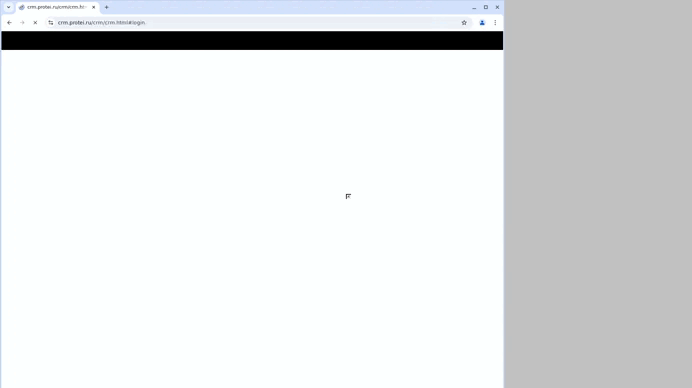

# НТЦ Протей

# Проект по автоматизации тестирования компании по разработке и производству программно-аппаратных продуктов для сферы телекоммуникаций НТЦ Протей [Protei.ru](https://protei.ru/)

## Содержание

- [Технологии и инструменты](#octocat-технологии-и-инструменты)
- [Список реализованных проверок в автотестах](#white_check_mark-список-реализованных-проверок-в-автотестах)
- [Запуск тестов в Jenkins с параметрам](#rocketl-Запуск-тестов-в-Jenkins-с-параметрами)
- [Отчет о результатах тестирования в Allure-reports](#bookmark_tabs-Отчет-о-результатах-тестрования-в-Allure-reports)
- [Уведомление в Telegram о результатах проверки с использованием бота](#loudspeaker-Уведомление-в-Telegram-о-результатах-проверки-с-использованием-бота)
- [Видео-отчет прохождения теста на Selenoid](#movie_camera-Видео-отчет-прохождения-теста-на-Selenoid)


#### [Сайт НТЦ Протей](https://protei.ru/)


## Цель проекта

Тестирование функции сайта, позволяющей сотрудникам пройти успешную авторизацию в личном кабинете.

### Проект реализован с использованием:
        

## Список реализованных проверок в автотестах

- Проверка неуспешной авторизации пользователя с использованием библиотеки Selene
- Проверка неуспешной авторизации пользователя с использованием библиотеки Selenium
- Проверка неуспешной авторизации пользователя с использованием библиотеки Selenium + применение фикстуры


----
### Локальный запуск
> Для локального запуска с дефолтными значениями необходимо выполнить команду:
```
python -m venv .venv
source .venv/bin/activate
pip install -r requirements.txt
pytest tests
```
> Для получения отчета необходимо выполнить команду:
```
allure serve tests/allure-results
```
----


## Удаленный запуск автотестов выполняется на сервере Jenkins
> [Ссылка на проект в Jenkins](https://jenkins.autotests.cloud/job/Protei_Nailia_Ales/) 


## Отчет о результатах тестирования в Allure-reports

После прохождения тестов автоматически формируется отчет в Allure Report. Allure формирует подробный отчет о результатах прогона тестов. Кастомные фильтры и листенеры делают отчет максимально понятным. Например, в отчет пишутся все селекторы и методы Selene, отчеты формируются по категориям.
После окончания выполнения автотестов по каждому из них в отчете доступны скриншоты, лог консоли браузера и видеозапись выполнения теста.

<p>


</p>

## Уведомление в Telegram о результатах проверки с использованием бота.

Настроено автоматическое оповещение о результатах прохождения тестов в Telegram-бот с полной информацией о прогоне и ссылкой на Allure

<p>

</p>

## Видео прохождения тестов на Selenoid

Видеозапись с выполнением теста.

<p>

</p>

